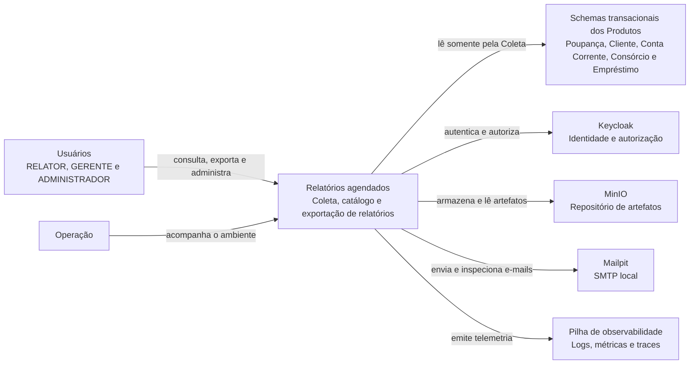
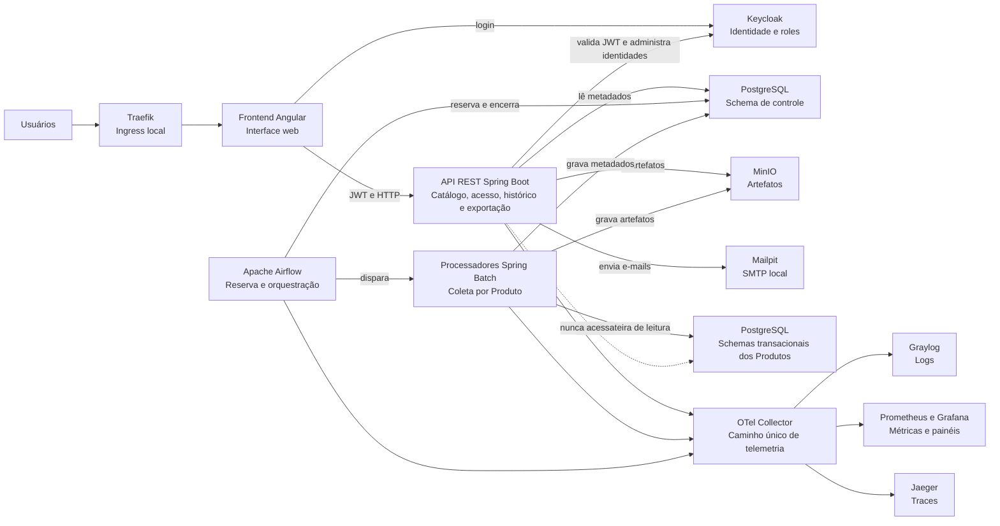

# C4 — Contexto e contêineres

Este documento mostra a fronteira do sistema e seus contêineres. As decisões e consequências
permanecem em [`../arquitetura-inicial.md`](../arquitetura-inicial.md) e nos
[`../adr/`](../adr/).

## Nível 1 — Contexto

## Nível 2 — Contêineres

O diagrama torna explícitas as fronteiras de RA-10 e RA-29: os processadores da Coleta são os
únicos leitores dos schemas transacionais; a API REST só lê o schema de controle e os artefatos já
apurados.
